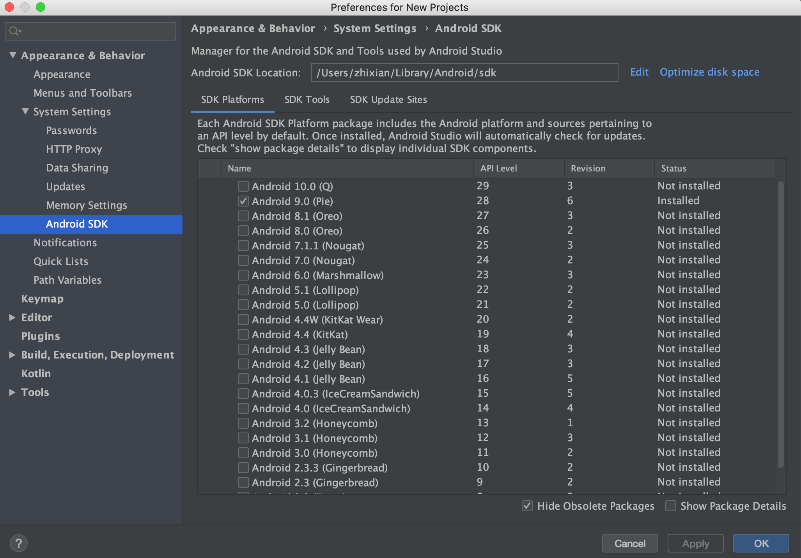
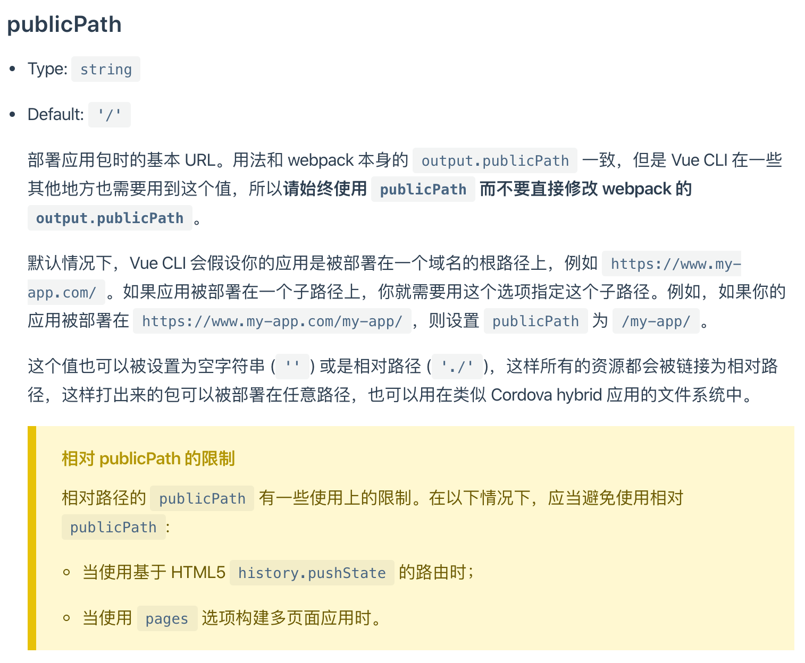
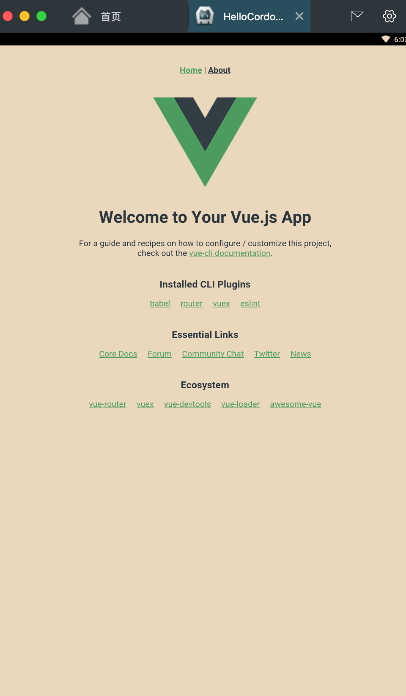

# vue-cordova 混合应用开发

> 1. vue + cordova 共用一个工作目录  
> 2. 一次开发，多个平台(apk、ios、electron、webview)


## 首先确保电脑上安装了对应的包（以下以android为例）

### cordova


1. 全局安装cordova脚手架 （npm i cordova -g）   
2. 创建cordova项目 （cordova create vue-cordova）
3. 添加cordova编译的平台，右边的命令为浏览器和安卓端 👉（cordova platform add android browser ）
4. 查看编译需要的一些扩展（库） cordova requirements   
   * jdk
   * gradle
   * Android SDK 
   * Android target  
> 安卓的SDK 最好是安装一个Android Studio 然后按照需要的sdk即可 (可以选择对应的版本号)  
 
---
5. 然后安装vue脚手架（npm i -g @vue/cli）
6. 创建项目,与cordova同名 （vue create vue-cordova ） 
7. 然后选择merge,配置对应vue需要的包
8. 然后新增文件 vue.config.js 具体配置项可以查看vue-cli官网 必须要填的的是 outputDir:'www' 和 publicPath:'./' 两项
   * 添加第一个是为了编译之后直接被cordova调用
   * 第二个是指明项目跟目录   


9. 修改main.js文件。如下：
```javascript
    if (window.location.protocol === 'file:' || window.location.port === '3000') {
    var cordovaScript = document.createElement('script')
    cordovaScript.setAttribute('type', 'text/javascript')
    cordovaScript.setAttribute('src', 'cordova.js')
    document.body.appendChild(cordovaScript)
    }
```

10. 然后就可以 （npm run build ）编译打包vue文件

---

11. 创建apk文件 cordova build android ，这里也可以创建ios应用  cordova build ios 需要安装对应的环境 一下为安卓模拟器安装编译好的sdk


